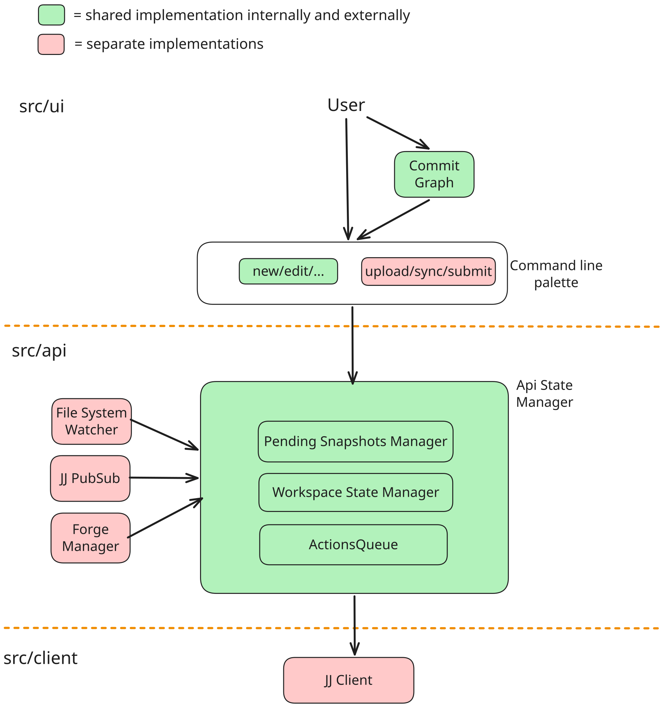

The JJ-Dojo VS Code extension was initially developed by the JJ team at Google to serve internal Google developers. It is designed with Google-internal concepts like monorepos or CLs in mind, and requires abstractions and external implementations for it to work outside of Google.

In this document, we outline the overall structure of the extension, identify the specific areas requiring modifications, and establish the project timelines. The goal of this doc is to give contributors a high-level overview of the plan to externalize the extension.

## Overall Structure

Below is a diagram of the internal extension. It is separated into 3 layers: UI, API, and client. The green components are planned to be shared between internal and external, while the red components need to be abstracted with separate implementations. We will quickly go over them below.

TIP: If you want to update the svg, its source is available at https://excalidraw.com/#json=4Zpj4HILt0rQ2xZfxXdZl,KcmUsjmXiroY7CWoc6NtZw

The UI layer is mostly reusable code that can be shared between internal and external. It includes:

- the VS Code commands. Most of them should be shared, except for forge-related commands like upload/sync/submit.
- the commit graph
- the split editor
- the commit dialog: very hard to externalize due to its strong internal ties
- the VS Code file system providers
- conflict marker highlighter
- package.json: hard to share due to very different contents

The API layer includes:

- ApiStateManager: this is the orchestration layer that combines information from all components in the API layer
- WorkspaceStateManager: it fetches information from the client (using gRPC-web internally, and the CLI externally) and caches it. It refetches when there are FileSystemWatcher events.
- PendingSnapshotsManager: This component takes FileSystemWatcher events and creates an estimated workspace state based on the changed files. This component is optional, and used to hide latencies from users.
- ActionsQueue: All write operations are queued and executed sequentially to avoid them racing with each other or causing divergence.
- FileSystemWatcher: A watcher that watches for file system changes and feeds the events to WorkspaceStateManager and PendingSnapshotsManager
- JJ PubSub: A watcher that watches for changes to the global op head
- Forge Manager: Internally it's called ChangelistStateManager, which fetches CL state and listens to the Piper pubsub for CL state changes. Externally this will need separate implementations for each Forge we want to support (GitHub, Gerrit, etc.). Internally CLs have a 1:1 mapping to a commit, and only a single remote is supported. Externally for GitHub PRs it'll need to support 1:N mappings, and possibly support multiple remotes.

The client layer fetches information about JJ. Internally we use gRPC-web that fetches information from our prod servers. Externally we'll use the CLI with [templates](https://docs.jj-vcs.dev/latest/templates/) to get the equivalent information. Long-term, we may swap out the CLI client implementation with a [daemon implementation](https://docs.jj-vcs.dev/latest/templates/). Note that creating a CLI implementation might be trickier than one might assume. Our internal extension sends requests to our jj server, which is built on top of JJ lib directly. It exposes information that is not always exposed in the CLI (e.g. file IDs), or exposes information that needs several CLI commands to get. We may need to converge the internal server with the CLI during the open-sourcing process.

## Milestones

Below is the timeline we're aiming for.

- Milestone 1: Oct 2026 - Nov 2026 (1 month)
- Milestone 2: Nov 2026 - Feb 2027 (3 months)
- Milestone 3: Feb 2027 - Apr 2027 (2 months)
- Milestone 4: Apr 2027 - Jun 2027 (2 months)

Milestone 1 - Showing commit graph + modified files without refreshes

- [Done] Open sourcing the commit graph
- [In progress] JJ Subprocess Client
- Upstreaming 'Open Diff' related commands

Milestone 2 - Support refreshes

- [In progress] FileSystemWatcher
- Upstreaming PendingSnapshotsManager
- JJ PubSub
- Multi-workspace support

Milestone 3 - Basic mutational operations

- Upstreaming ActionsQueue
- jj new/edit/squash commands
- jj describe/commit commands, will require commit dialog webview

Milestone 4 - Forge integration

- Support publishing to GitHub, and possibly Gerrit
- Support upload/sync

## Design considerations

- Use Bazel for builds. Internally our extension runs on Cider (i.e. a VS Code Web fork), which is not allowed to import packages like `node`. This project uses the Bazel `deps` attribute to limit which parts of the codebase are allowed to include which dependencies. Code should be abstracted to interface files and implementation files, and only the implementation files are allowed to import external-only packages.
- Avoid dependencies as much as possible. To reduce the vector of supply chain attacks, and also to avoid the headache of importing TypeScript libraries into Google, we avoid dependencies as much as possible.
- Reads should stay reads. We'll use `--no-integrate-operation` and `--ignore-working-copy` to avoid causing divergence, or polluting the user's op log unnecessarily.
- Different defaults between internal and external. Google developers are used to having configs like `jj.includeWorkingCopyInParentDiffs` set to `true`, or `threeWayMerge.enabled` set to `true`. We should investigate whether these setting defaults make sense externally.
- We are still lacking some features internally like blame, squash part of the file, ... These can be implemented in parallel by external contributors while externalization is ongoing.
